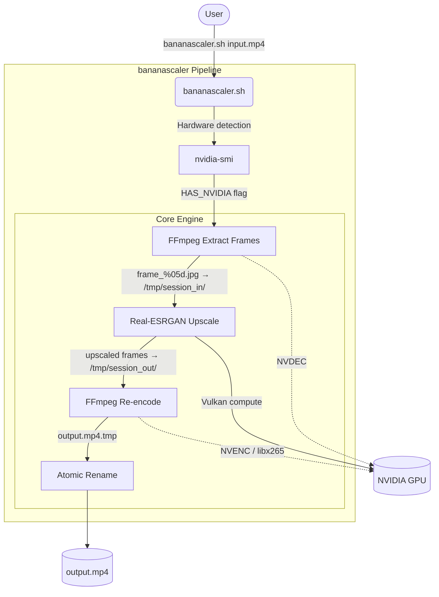
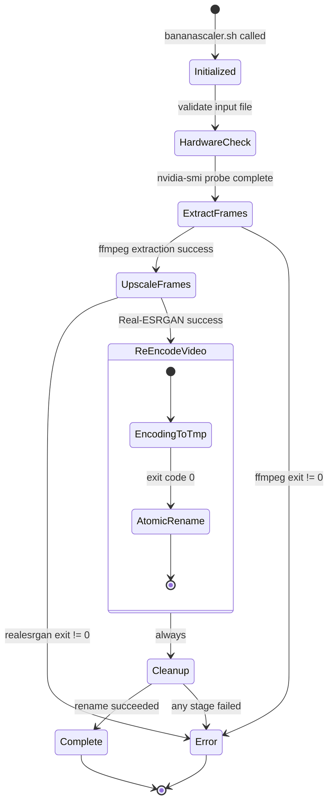

<table border="0">
  <tr>
    <td valign="top">
      <h1>bananascaler</h1>
      <p><strong>GPU-accelerated neural video upscaling via Real-ESRGAN + FFmpeg.</strong><br/>
      <em>A hardened Bash script that scales videos up to 4× using neural super-resolution, with automatic NVIDIA hardware acceleration and atomic output guarantees.</em></p>
      <p>
        <a href="LICENSE"></a>
        
        
        
        
      </p>
    </td>
  </tr>
</table>

---

<!--toc:start-->
- [bananascaler](#bananascaler)
  - [Overview](#overview)
  - [Requirements](#requirements)
  - [Installation](#installation)
  - [Key Features (v0.1.0)](#key-features-v010)
  - [Technical Architecture](#technical-architecture)
  - [Processing Pipeline](#processing-pipeline)
  - [Usage](#usage)
  - [Roadmap & Milestones](#roadmap--milestones)
  - [Acknowledgments](#acknowledgments)
  - [License](#license)
<!--toc:end-->

## Overview

**bananascaler** is a zero-dependency Bash pipeline that enhances video resolution using neural super-resolution. It orchestrates `realesrgan-ncnn-vulkan` for per-frame AI upscaling and `ffmpeg` for lossless audio muxing and hardware-accelerated re-encoding.

The script detects your hardware at runtime: if an NVIDIA GPU is present, it activates NVDEC for decoding and NVENC for final encoding, keeping CPU load minimal. Without NVIDIA, it falls back to software codecs transparently.

---

## Requirements

| Dependency | Purpose | Notes |
|---|---|---|
| `ffmpeg` | Frame extraction and final encoding | NVENC support strongly recommended |
| `realesrgan-ncnn-vulkan` | Neural super-resolution | Must be in `$PATH` |
| NVIDIA drivers + CUDA | Hardware acceleration | Optional, auto-detected |

---

## Installation

### From Source

```bash
git clone https://github.com/julesklord/bananascaler.git
cd bananascaler
chmod +x src/bananascaler.sh
```

### Dependencies (Arch Linux / CachyOS)

```bash
# FFmpeg
sudo pacman -S ffmpeg

# Real-ESRGAN (Vulkan backend)
mkdir -p ~/.local/share/realesrgan && cd ~/.local/share/realesrgan
curl -sL -O "https://github.com/xinntao/Real-ESRGAN/releases/download/v0.2.5.0/realesrgan-ncnn-vulkan-20220424-ubuntu.zip"
unzip realesrgan-ncnn-vulkan-20220424-ubuntu.zip
rm realesrgan-ncnn-vulkan-20220424-ubuntu.zip
chmod +x realesrgan-ncnn-vulkan
ln -sf ~/.local/share/realesrgan/realesrgan-ncnn-vulkan ~/.local/bin/realesrgan-ncnn-vulkan
```

---

## Key Features (v0.1.0)

*   **Neural Super-Resolution**: Frame-level upscaling via `realesr-animevideov3-x2`, supporting 2×, 3×, and 4× scale factors.
*   **Automatic GPU Detection**: Detects NVIDIA via `nvidia-smi` at runtime; activates NVDEC + NVENC or falls back to `libx265`.
*   **Atomic Output**: Encodes to a `.tmp` file; renames to final destination only on success. Interrupted runs leave no corrupt files.
*   **Audio Preservation**: Original audio is remuxed without re-encoding (`-c:a copy`), maintaining lossless fidelity.
*   **Session Isolation**: Each run creates a unique temp directory (`/tmp/bananascaler_{timestamp}_{PID}`) preventing conflicts.
*   **Framerate Sync**: Uses `ffprobe` to extract the exact source framerate for perfect audio-video sync in the output.
*   **Smart Output Naming**: Auto-generates `{input}_upscaled.mp4` when no output path is given.

---

## Technical Architecture

The pipeline is a sequential 4-stage process coordinated by a single Bash script. External tools handle the heavy lifting; the script provides the orchestration and safety guarantees.



### Core Components

- **`bananascaler.sh`**: Orchestrator. Handles argument parsing, hardware detection, stage execution, error propagation, and cleanup.
- **`realesrgan-ncnn-vulkan`**: Neural inference engine. Runs on Vulkan, GPU-agnostic (NVIDIA, AMD, Intel).
- **`ffmpeg`**: Frame I/O and codec layer. NVDEC decode, NVENC/libx265 encode.

---

## Processing Pipeline

The script executes four sequential stages with strict exit-code validation between each.



### Key Engineering Decisions

- **JPEG for intermediate frames, not PNG**: Reduces temp disk usage by ~60–70% and lowers I/O pressure on NVMe. The quality delta at `-q:v 2` is imperceptible for upscaling input.
- **Vulkan backend (ncnn) over CUDA-only**: `realesrgan-ncnn-vulkan` works on any GPU vendor via Vulkan, making the tool portable across NVIDIA, AMD, and Intel Arc.
- **Atomic write (`output.tmp` → rename)**: A `SIGKILL` mid-encode will leave a `.tmp` artifact, never a silently corrupt `.mp4` that passes file-size checks.

---

## Usage

```bash
src/bananascaler.sh <input_video> [output_video] [scale_factor (2|3|4)]
```

### Examples

**Auto-name output, default 2× scale:**
```bash
src/bananascaler.sh movie.mp4
# → movie_upscaled.mp4
```

**Specify output and 4× scale:**
```bash
src/bananascaler.sh input.mp4 output_4k.mp4 4
```

**Background execution for long videos:**
```bash
nohup src/bananascaler.sh input.mp4 output.mp4 2 > bananascaler.log 2>&1 &
```

For full documentation, see **[docs/wiki/index.md](docs/wiki/index.md)**.

---

## Roadmap & Milestones

| Version | Status | Milestone |
|---|---|---|
| **v0.1.0** | ✅ | Core pipeline: extract → upscale → re-encode → atomic output |
| **v0.2.0** | ⏳ | Progress indicator (frame count / ETA display) |
| **v0.3.0** | ⏳ | Model selection flag (`--model`) for non-anime content |
| **v0.4.0** | ⏳ | Parallel frame extraction/upscaling for multi-GPU setups |

---

## Acknowledgments

- **[xinntao / Real-ESRGAN](https://github.com/xinntao/Real-ESRGAN)** — Neural super-resolution models and ncnn Vulkan inference backend.
- **[FFmpeg](https://ffmpeg.org)** — Video demuxing, frame I/O, NVDEC/NVENC hardware codec layer.

## License

<p align="center">
  Engineered by <a href="https://github.com/julesklord">julesklord</a>.<br>
  Released under the terms of the MIT License.
</p>
