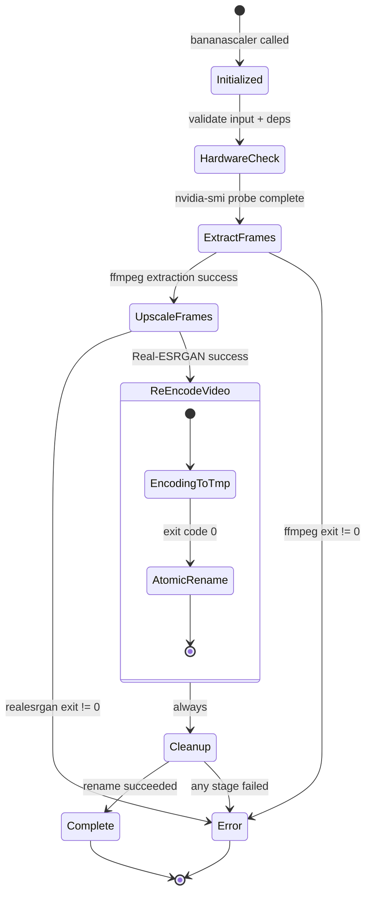

<table border="0">
  <tr>
    <td width="200" align="center" valign="middle">
      
    </td>
    <td valign="top">
      <h1>bananascaler</h1>
      <p><strong>GPU-accelerated neural video upscaler with interactive TUI.</strong><br/>
      <em>A Go CLI tool that scales videos up to 4× using Real-ESRGAN neural super-resolution, with automatic NVIDIA hardware acceleration, atomic output, and a live Bubbletea dashboard.</em></p>
      <p>
        <a href="LICENSE"></a>
        
        
        
        
        
      </p>
    </td>
  </tr>
</table>

---

<!--toc:start-->
- [Overview](#overview)
- [Requirements](#requirements)
  - [Build Requirements (from source)](#build-requirements-from-source)
- [Installation](#installation)
  - [Pre-built Binary](#pre-built-binary)
  - [From Source](#from-source)
  - [System-wide Install](#system-wide-install)
  - [Dependencies (Arch Linux / CachyOS)](#dependencies-arch-linux-cachyos)
- [Key Features](#key-features)
- [Technical Architecture](#technical-architecture)
  - [Core Components](#core-components)
- [Processing Pipeline](#processing-pipeline)
  - [Key Engineering Decisions](#key-engineering-decisions)
- [Usage](#usage)
  - [Flags](#flags)
  - [Examples](#examples)
- [TUI Dashboard](#tui-dashboard)
- [Roadmap & Milestones](#roadmap-milestones)
- [Acknowledgments](#acknowledgments)
- [License](#license)
<!--toc:end-->

## Overview

**bananascaler** is a Go CLI tool that enhances video resolution using neural super-resolution. It orchestrates `realesrgan-ncnn-vulkan` for per-frame AI upscaling and `ffmpeg` for lossless audio muxing and hardware-accelerated re-encoding.

When run in a terminal, it renders an interactive **Bubbletea TUI** with live progress bars, stage tracking, and a scrollable log. When piped or run with `--no-tui`, it falls back to plain text output suitable for scripting and CI.

---

## Requirements

| Dependency | Purpose | Notes |
|---|---|---|
| `ffmpeg` | Frame extraction and final encoding | NVENC support strongly recommended |
| `realesrgan-ncnn-vulkan` | Neural super-resolution | Must be in `$PATH` |
| NVIDIA drivers + CUDA | Hardware acceleration | Optional, auto-detected |

### Build Requirements (from source)

| Tool | Version | Purpose |
|---|---|---|
| `go` | ≥ 1.22 | Compiler |
| `ffmpeg` | Any recent | Runtime dependency |
| `realesrgan-ncnn-vulkan` | v0.2.5.0+ | Runtime dependency |

---

## Installation

### Pre-built Binary

```bash
# Available in bin/bananascaler
./bin/bananascaler input.mp4
```

### From Source

```bash
git clone https://github.com/julesklord/bananascaler.git
cd bananascaler
make build
# Binary ready at ./bin/bananascaler
```

### System-wide Install

```bash
make install
# Available as bananascaler in $GOPATH/bin
```

### Dependencies (Arch Linux / CachyOS)

```bash
# FFmpeg
sudo pacman -S ffmpeg

# Real-ESRGAN (Vulkan backend)
mkdir -p ~/.local/share/realesrgan && cd ~/.local/share/realesrgan
curl -sL -O "https://github.com/xinntao/Real-ESRGAN/releases/download/v0.2.5.0/realesrgan-ncnn-vulkan-20220424-ubuntu.zip"
unzip realesrgan-ncnn-vulkan-20220424-ubuntu.zip
rm realesrgan-ncnn-vulkan-20220424-ubuntu.zip
chmod +x realesrgan-ncnn-vulkan
ln -sf ~/.local/share/realesrgan/realesrgan-ncnn-vulkan ~/.local/bin/realesrgan-ncnn-vulkan
```

---

## Key Features

*   **Interactive TUI**: Live Bubbletea dashboard with progress bars, stage tracking, and scrollable logs. Auto-detected in terminals; falls back to plain text when piped.
*   **Neural Super-Resolution**: Frame-level upscaling via `realesr-animevideov3-x2`, supporting 2×, 3×, and 4× scale factors.
*   **Automatic GPU Detection**: Detects NVIDIA via `nvidia-smi` at runtime; activates NVDEC + NVENC or falls back to `libx265`.
*   **Atomic Output**: Encodes to a `.tmp` file; renames to final destination only on success. Interrupted runs leave no corrupt files.
*   **Audio Preservation**: Original audio is remuxed without re-encoding (`-c:a copy`), maintaining lossless fidelity.
*   **Session Isolation**: Each run creates a unique temp directory (`/tmp/bananascaler_{timestamp}_{PID}`) preventing conflicts.
*   **Framerate Sync**: Uses `ffprobe` to extract the exact source framerate for perfect audio-video sync.
*   **Smart Output Naming**: Auto-generates `{input}_upscaled.mp4` when no output path is given.
*   **Graceful Cancellation**: Ctrl+C triggers cleanup of temp files before exit.

---

## Technical Architecture

The pipeline is a sequential 3-stage process coordinated by a Go CLI. External tools handle the heavy lifting; Go provides the orchestration, TUI, and safety guarantees.

``` 
graph TD 
    User([User]) -->|"bananascaler input.mp4"| CLI(Cobra CLI)

    subgraph bananascaler
        CLI -->|"TTY detected?"| TTY{Terminal?}
        TTY -->|"yes"| TUI[Bubbletea TUI]
        TTY -->|"no / --no-tui"| Plain[StdoutLogger]
        TUI -->|"Logger interface"| Pipeline
        Plain -->|"Logger interface"| Pipeline

        subgraph Pipeline
            Pipeline -->|"Hardware detection"| Detect[nvidia-smi]
            Detect --> Stage1[Stage 1: FFmpeg Extract]
            Stage1 --> Stage2[Stage 2: Real-ESRGAN Upscale]
            Stage2 --> Stage3[Stage 3: FFmpeg Re-encode]
            Stage3 --> Atomic[Atomic Rename]
        end
    end

    Stage1 -.->|"NVDEC"| GPU[(NVIDIA GPU)]
    Stage3 -.->|"NVENC / libx265"| GPU
    Stage2 -->|"Vulkan compute"| GPU
    Atomic --> Output[(output.mp4)]
```

### Core Components

- **`cmd/root.go`**: Cobra CLI definition. Detects TTY, launches Bubbletea or plain logger.
- **`internal/pipeline/pipeline.go`**: Core engine. Orchestrates the 3-stage processing chain via a `Logger` interface.
- **`internal/tui/`**: Bubbletea TUI layer — model, styles, messages, and pipeline adapter.
- **`internal/hardware/detect.go`**: GPU detection and media probing via external tools.
- **`internal/config/config.go`**: Configuration struct with validation.

---

## Processing Pipeline

The pipeline executes three sequential stages with strict exit-code validation between each.



### Key Engineering Decisions

- **JPEG for intermediate frames, not PNG**: Reduces temp disk usage by ~60–70% and lowers I/O pressure on NVMe.
- **Vulkan backend (ncnn) over CUDA-only**: `realesrgan-ncnn-vulkan` works on any GPU vendor via Vulkan, making the tool portable.
- **Atomic write (`output.tmp` → rename)**: A `SIGKILL` mid-encode will leave a `.tmp` artifact, never a silently corrupt `.mp4`.
- **Logger interface**: Decouples pipeline from output method — enables TUI, plain text, or programmatic consumers.

---

## Usage

```bash
bananascaler <input> [flags]
```

### Flags

| Flag | Short | Default | Description |
|------|-------|---------|-------------|
| `--output` | `-o` | `<input>_upscaled.mp4` | Output file path |
| `--scale` | `-s` | `2` | Upscale factor: 2, 3, or 4 |
| `--gpu` | `-g` | `0` | GPU device index (-1 = CPU) |
| `--model` | `-m` | `realesr-animevideov3-x2` | Real-ESRGAN model name |
| `--verbose` | `-v` | `false` | Forward ffmpeg/realesrgan output |
| `--no-tui` | | `false` | Disable interactive TUI |

### Examples

**Auto-name output, default 2× scale (with TUI):**
```bash
bananascaler movie.mp4
```

**Specify output and 4× scale:**
```bash
bananascaler input.mp4 --output output_4k.mp4 --scale 4
```

**Plain text mode for scripting:**
```bash
bananascaler input.mp4 --no-tui --scale 2
```

**Background execution:**
```bash
nohup bananascaler input.mp4 --output out.mp4 --scale 4 --no-tui > run.log 2>&1 &
```

---

## TUI Dashboard

When run in a terminal, bananascaler renders an interactive dashboard:

```
┌─────────────────────────────────────────────────────────┐
│  🍌 bananascaler                                         │
│                                                          │
│  GPU device 0 (NVDEC+NVENC)  │  Model: realesr-animevideov3-x2  │  Scale: 2×
│  In: movie.mp4  │  Out: movie_upscaled.mp4               │
├─────────────────────────────────────────────────────────┤
│                                                          │
│  [✓] Stage 1/3 — Frame Extraction                        │
│      ████████████████████████████████████  12847/12847   │
│                                                          │
│  [▶] Stage 2/3 — Neural Upscaling                        │
│      ██████████████░░░░░░░░░░░░░░░░░░░░░  4127/12847    │
│                                                          │
│  [·] Stage 3/3 — Re-encode + Mux                         │
│      waiting...                                          │
├─────────────────────────────────────────────────────────┤
│  [INFO] NVIDIA GPU detected — enabling NVDEC + NVENC     │
│  [ OK ] 12847 frames extracted.                          │
├─────────────────────────────────────────────────────────┤
│  q: cancel  │  v: toggle verbose                         │
└─────────────────────────────────────────────────────────┘
```

**Keybinds**: `q`/`Ctrl+C`/`Esc` to cancel, `v` to toggle verbose output.

---

## Roadmap & Milestones

| Version | Status | Milestone |
|---|---|---|
| **v0.1.0** | ✅ | Core pipeline: extract → upscale → re-encode → atomic output (Bash) |
| **v0.2.0** | ✅ | Go rewrite + Bubbletea TUI + Logger interface + quality fixes |
| **v0.3.0** | ⏳ | Model selection with validation + GPU index validation |
| **v0.4.0** | ⏳ | Parallel frame extraction/upscaling for multi-GPU setups |

---

## Acknowledgments

- **[xinntao / Real-ESRGAN](https://github.com/xinntao/Real-ESRGAN)** — Neural super-resolution models and ncnn Vulkan inference backend.
- **[FFmpeg](https://ffmpeg.org)** — Video demuxing, frame I/O, NVDEC/NVENC hardware codec layer.
- **[Charm](https://github.com/charmbracelet)** — Bubbletea TUI framework and Lipgloss styling.

## License

<p align="center">
  Engineered by <a href="https://github.com/julesklord">julesklord</a>.<br>
  Released under the terms of the MIT License.
</p>
