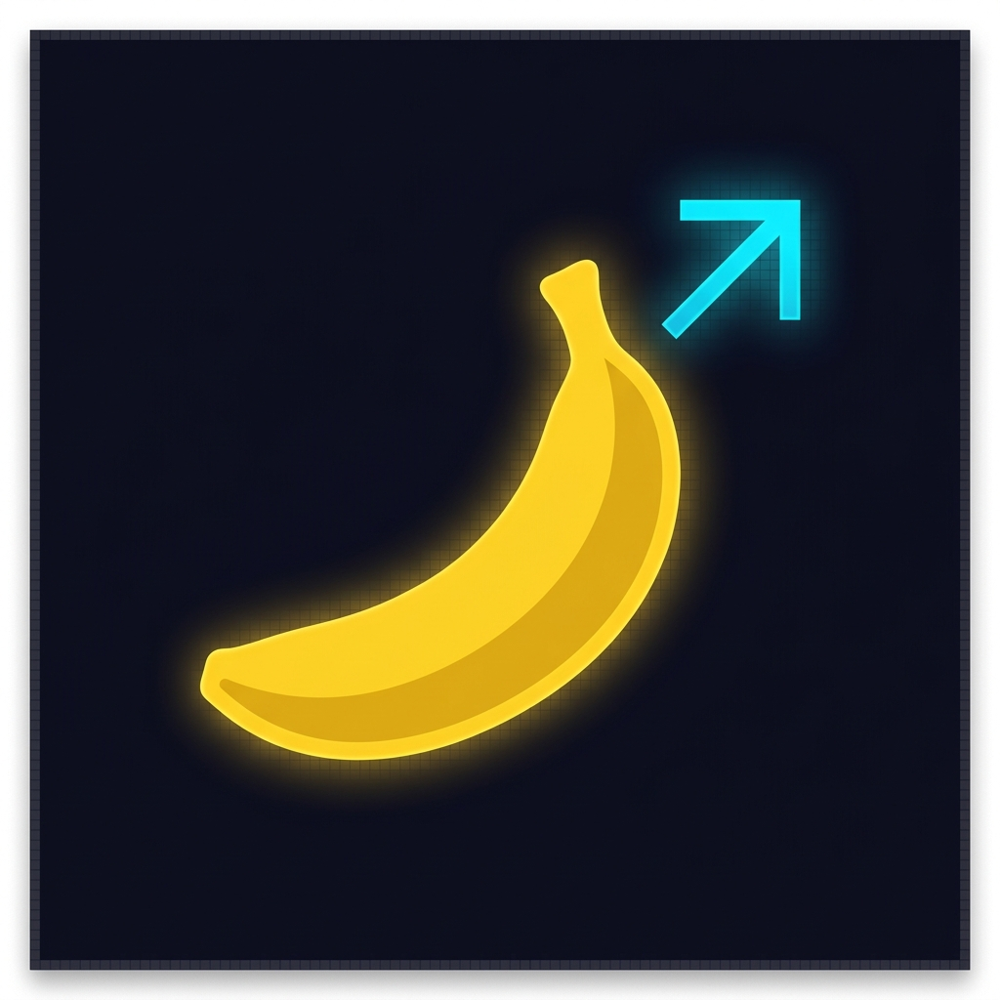
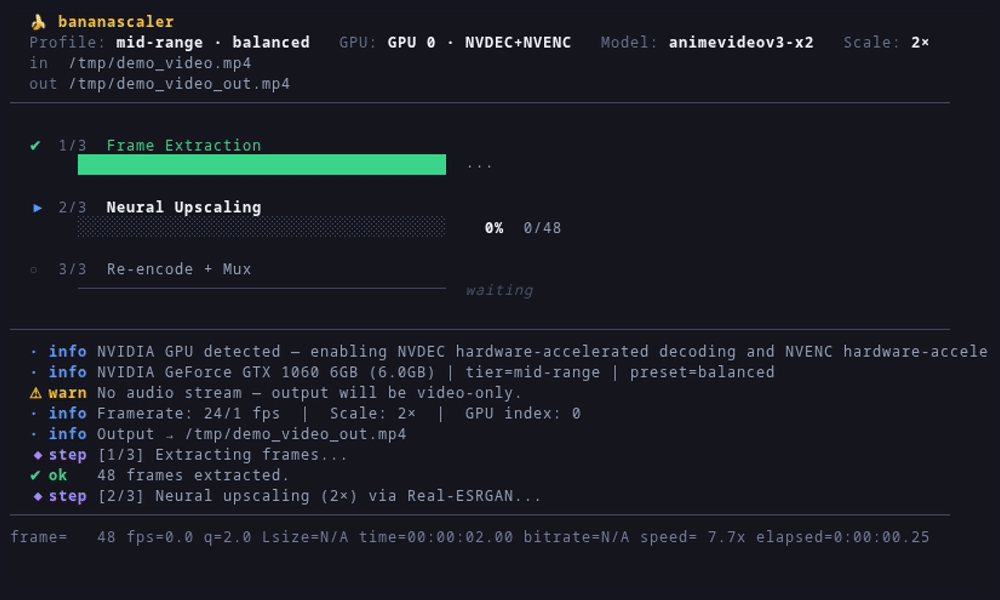
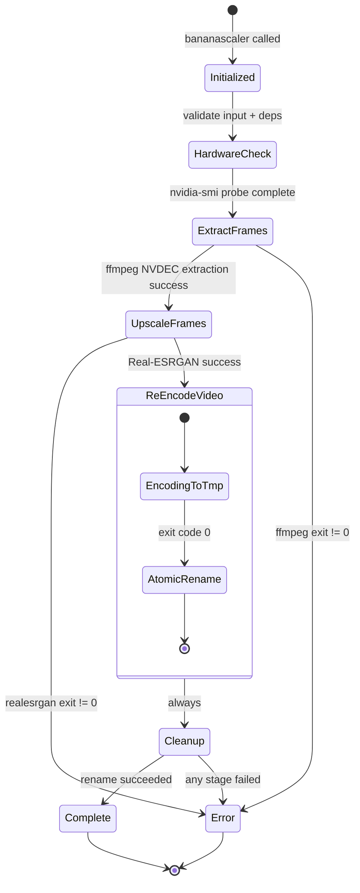

<table border="0">
  <tr>
    <td width="200" align="center" valign="middle">
      
    </td>
    <td valign="top">
      <h1>bananascaler</h1>
      <p><strong>GPU-accelerated neural video upscaler with interactive TUI.</strong><br/>
      <em>A Go CLI tool that scales videos up to 4× using Real-ESRGAN neural super-resolution, with automatic NVIDIA hardware acceleration, atomic output, and a live Bubbletea dashboard.</em></p>
      <p>
        <a href="LICENSE"></a>
        
        
        
        
        
      </p>
    </td>
  </tr>
</table>

---

<!--toc:start-->
- [Overview](#overview)
- [Requirements](#requirements)
  - [Build Requirements (from source)](#build-requirements-from-source)
- [Installation](#installation)
  - [Pre-built Binary](#pre-built-binary)
  - [From Source](#from-source)
  - [System-wide Install](#system-wide-install)
  - [Dependencies (Arch Linux / CachyOS)](#dependencies-arch-linux-cachyos)
- [Key Features](#key-features)
- [Profiles](#profiles)
  - [Hardware Tiers](#hardware-tiers)
  - [Presets](#presets)
  - [Profile Table](#profile-table)
  - [VRAM Safety](#vram-safety)
- [Technical Architecture](#technical-architecture)
  - [Core Components](#core-components)
- [Processing Pipeline](#processing-pipeline)
  - [Key Engineering Decisions](#key-engineering-decisions)
- [Usage](#usage)
  - [CLI Mode](#cli-mode)
  - [TUI File-Selection Mode](#tui-file-selection-mode)
  - [Flags](#flags)
  - [Examples](#examples)
- [TUI Dashboard](#tui-dashboard)
- [Roadmap & Milestones](#roadmap-milestones)
- [Acknowledgments](#acknowledgments)
- [License](#license)
<!--toc:end-->



## Overview

**bananascaler** is a Go CLI tool that enhances video resolution using neural super-resolution. It orchestrates `realesrgan-ncnn-vulkan` for per-frame AI upscaling and `ffmpeg` for lossless audio muxing and hardware-accelerated re-encoding.

When run in a terminal, it renders an interactive **Bubbletea TUI** with live progress bars, stage tracking, and a scrollable log. When piped or run with `--no-tui`, it falls back to plain text output suitable for scripting and CI.

Since **v0.3.0**, running `bananascaler tui` opens an interactive file-browser so you can pick any video file in the current directory and start upscaling — no arguments required.

---

## Requirements

| Dependency | Purpose | Notes |
|---|---|---|
| `ffmpeg` | Frame extraction and final encoding | NVENC support strongly recommended |
| `realesrgan-ncnn-vulkan` | Neural super-resolution | Must be in `$PATH` |
| NVIDIA drivers + CUDA | Hardware acceleration | Optional, auto-detected |

### Build Requirements (from source)

| Tool | Version | Purpose |
|---|---|---|
| `go` | ≥ 1.22 | Compiler |
| `ffmpeg` | Any recent | Runtime dependency |
| `realesrgan-ncnn-vulkan` | v0.2.5.0+ | Runtime dependency |

---

## Installation

### Pre-built Binary

```bash
# Available in bin/bananascaler
./bin/bananascaler input.mp4
```

### From Source

```bash
git clone https://github.com/julesklord/bananascaler.git
cd bananascaler
make build
# Binary ready at ./bin/bananascaler
```

### System-wide Install

```bash
sudo make install
# Installs to /usr/local/bin/bananascaler

# Custom prefix:
sudo PREFIX=/usr make install   # → /usr/bin/bananascaler
```

### Dependencies (Arch Linux / CachyOS)

```bash
# FFmpeg
sudo pacman -S ffmpeg

# Real-ESRGAN (Vulkan backend)
mkdir -p ~/.local/share/realesrgan && cd ~/.local/share/realesrgan
curl -sL -O "https://github.com/xinntao/Real-ESRGAN/releases/download/v0.2.5.0/realesrgan-ncnn-vulkan-20220424-ubuntu.zip"
unzip realesrgan-ncnn-vulkan-20220424-ubuntu.zip
rm realesrgan-ncnn-vulkan-20220424-ubuntu.zip
chmod +x realesrgan-ncnn-vulkan
ln -sf ~/.local/share/realesrgan/realesrgan-ncnn-vulkan ~/.local/bin/realesrgan-ncnn-vulkan
```

---

## Key Features

*   **Hardware-aware profiles**: Auto-detects GPU VRAM and selects optimal tile size, model, and encoding parameters. Choose `fast`, `balanced`, or `quality` — settings are adapted to your hardware tier.
*   **Interactive TUI with file browser**: `bananascaler tui` opens a keyboard-navigable file picker in the current directory. Select a video and press Enter — the pipeline launches immediately inside the same TUI.
*   **Full GPU pipeline**: NVDEC hardware-accelerated decoding in frame extraction + Vulkan-accelerated Real-ESRGAN upscaling + NVENC hardware-accelerated encoding. All three stages run on the GPU.
*   **VRAM-safe tiling**: Tile sizes are scaled to detected VRAM and model weight class. `CheckTileSafety()` warns before exceeding safe limits, preventing OOM/SEGV crashes.
*   **Neural Super-Resolution**: Frame-level upscaling via `realesr-animevideov3-x2` (lightweight), `realesrgan-x4plus-anime` (medium), or `realesrgan-x4plus` (heavy), supporting 2×, 3×, and 4× scale factors.
*   **`bananascaler detect`**: Hardware scan subcommand showing your GPU info and all available profiles adapted to your system.
*   **Atomic Output**: Encodes to a `.tmp` file; renames to final destination only on success. Interrupted runs leave no corrupt files.
*   **Audio Preservation**: Original audio is remuxed without re-encoding (`-c:a copy`), maintaining lossless fidelity.
*   **Session Isolation**: Each run creates a unique temp directory (`/tmp/bananascaler_{timestamp}_{PID}`) preventing conflicts.
*   **Framerate Sync**: Uses `ffprobe` to extract the exact source framerate for perfect audio-video sync.
*   **Smart Output Naming**: Auto-generates `{input}_upscaled.mp4` when no output path is given.
*   **Graceful Cancellation**: Ctrl+C triggers cleanup of temp files before exit.

---

## Profiles

bananascaler auto-detects your GPU's VRAM via `nvidia-smi` and selects optimized pipeline parameters. Three presets let you trade speed for quality.

### Hardware Tiers

| Tier | VRAM | Example GPUs |
|------|------|-------------|
| **low-end** | ≤4 GB | GTX 1050 Ti, GTX 1650, RX 570 |
| **mid-range** | 4–8 GB | GTX 1060 6GB, RTX 2060, RX 5700 XT |
| **high-end** | ≥8 GB | RTX 3080, RTX 4090, RX 6800 XT |
| **unknown** | no NVIDIA | CPU-only mode / integrated GPU |

### Presets

| Preset | Focus | When to use |
|--------|-------|-------------|
| **fast** | Speed | Quick preview, short videos, time-constrained |
| **balanced** | Default | Recommended for most users |
| **quality** | Best output | Final render, archival, when time doesn't matter |

### Profile Table

Each tier × preset combination sets tile size, model, NVENC preset, x265 preset/CRF, and max scale:

| Tier | Preset | Tile | Model | NVENC | x265 | CRF | Max Scale |
|------|--------|------|-------|-------|------|-----|-----------|
| low-end | fast | 64 | animevideov3-x2 | p1 | ultrafast | 28 | 2× |
| low-end | balanced | 100 | animevideov3-x2 | p3 | fast | 26 | 2× |
| low-end | quality | 150 | animevideov3-x2 | p5 | medium | 24 | 3× |
| mid-range | fast | 150 | animevideov3-x2 | p3 | fast | 26 | 3× |
| **mid-range** | **balanced** | **300** | **animevideov3-x2** | **p5** | **medium** | **22** | **4×** |
| mid-range | quality | 200 | x4plus-anime | p7 | slow | 20 | 4× |
| high-end | fast | 300 | x4plus-anime | p4 | medium | 22 | 4× |
| high-end | balanced | 400 | x4plus | p6 | slow | 20 | 4× |
| high-end | quality | 512 | x4plus | p7 | veryslow | 18 | 4× |

The **bold** row is the default for mid-range GPUs (e.g., GTX 1060 6GB).

### VRAM Safety

Heavier models require smaller tiles on the same GPU. Using `realesrgan-x4plus` with tile=400 on a 6GB GPU will crash. The profile system enforces safe pairings, and `CheckTileSafety()` warns at startup if manual overrides exceed safe limits.

Run `bananascaler detect` to see your hardware and all available profiles.

---

## Technical Architecture

The pipeline is a sequential 3-stage process coordinated by a Go CLI. External tools handle the heavy lifting; Go provides the orchestration, TUI, and safety guarantees.

``` 
graph TD 
    User([User]) -->|"bananascaler input.mp4"| CLI(Cobra CLI)
    User -->|"bananascaler tui"| TUICmd(tui subcommand)
    TUICmd --> Explorer[File Explorer TUI]
    Explorer -->|"Enter on video"| Pipeline

    subgraph bananascaler
        CLI -->|"TTY detected?"| TTY{Terminal?}
        TTY -->|"yes"| TUI[Bubbletea TUI]
        TTY -->|"no / --no-tui"| Plain[StdoutLogger]
        TUI -->|"Logger interface"| Pipeline
        Plain -->|"Logger interface"| Pipeline

        subgraph Pipeline
            Pipeline -->|"Hardware detection"| Detect[nvidia-smi]
            Detect --> Stage1[Stage 1: FFmpeg Extract\nNVDEC hw-accel]
            Stage1 --> Stage2[Stage 2: Real-ESRGAN\nVulkan + tile safety]
            Stage2 --> Stage3[Stage 3: FFmpeg Re-encode\nNVENC hw-accel]
            Stage3 --> Atomic[Atomic Rename]
        end
    end

    Stage1 -..->|"NVDEC"| GPU[(NVIDIA GPU)]
    Stage3 -..->|"NVENC / libx265"| GPU
    Stage2 -->|"Vulkan compute"| GPU
    Atomic --> Output[(output.mp4)]
```

### Core Components

- **`cmd/root.go`**: Cobra CLI definition. Detects TTY, launches Bubbletea or plain logger. Handles `--profile`, `--auto`, and `detect` subcommand.
- **`cmd/tui.go`**: `tui` subcommand — launches the file-selection TUI in the working directory.
- **`internal/pipeline/pipeline.go`**: Core engine. Orchestrates the 3-stage processing chain via a `Logger` interface. Reads parameters from the active profile.
- **`internal/tui/`**: Bubbletea TUI layer — model (explorer + pipeline states, profile cycling), design system (styles), messages, and pipeline adapter.
- **`internal/hardware/detect.go`**: GPU detection and media probing via external tools.
- **`internal/hardware/profile.go`**: Hardware profile system — GPU VRAM detection, tier classification, 12 profile variants (4 tiers × 3 presets), VRAM safety validation.
- **`internal/config/config.go`**: Configuration struct with validation and profile resolution.

---

## Processing Pipeline

The pipeline executes three sequential stages with strict exit-code validation between each.



### Key Engineering Decisions

- **NVDEC hardware decoding in extraction**: `-hwaccel cuda` passed to FFmpeg in stage 1 so the GPU handles video demux and decode, reducing CPU load and extraction time.
- **Tile-based VRAM protection**: Tile sizes are dynamically set from the hardware profile, pairing heavier models with smaller tiles to prevent OOM/SEGV crashes.
- **Profile-driven parameters**: Tile size, model, JPEG quality, NVENC preset, and x265 preset/CRF are all read from the active profile instead of hardcoded, enabling automatic hardware adaptation.
- **JPEG for intermediate frames, not PNG**: Reduces temp disk usage by ~60–70% and lowers I/O pressure on NVMe.
- **Vulkan backend (ncnn) over CUDA-only**: `realesrgan-ncnn-vulkan` works on any GPU vendor via Vulkan, making the tool portable.
- **Atomic write (`output.tmp` → rename)**: A `SIGKILL` mid-encode will leave a `.tmp` artifact, never a silently corrupt `.mp4`.
- **Logger interface**: Decouples pipeline from output method — enables TUI, plain text, or programmatic consumers.

---

## Usage

### CLI Mode

Pass a video file directly — flags are optional:

```bash
bananascaler <input> [flags]
```

### TUI File-Selection Mode

Launch the interactive file browser in the current directory:

```bash
bananascaler tui [flags]
```

Navigate with `↑`/`↓` (or `j`/`k`), enter directories with `Enter` or `→`, go up with `Backspace` or `h`.
Cycle settings before launching: `s` (scale), `g` (GPU), `m` (model). Press `Enter` on a video file to start.

### Flags

| Flag | Short | Default | Description |
|------|-------|---------|-------------|
| `--output` | `-o` | `<input>_upscaled.mp4` | Output file path |
| `--scale` | `-s` | `2` | Upscale factor: 2, 3, or 4 |
| `--gpu` | `-g` | `0` | GPU device index (-1 = CPU) |
| `--model` | `-m` | `realesr-animevideov3-x2` | Real-ESRGAN model name |
| `--profile` | | `balanced` | Performance preset: `fast`, `balanced`, or `quality` |
| `--auto` | | `false` | Auto-detect GPU and apply optimal profile |
| `--verbose` | `-v` | `false` | Forward ffmpeg/realesrgan output |
| `--no-tui` | | `false` | Disable interactive TUI |

All flags are available on both the root command and the `tui` subcommand.

### Examples

**Hardware detection (new in v0.4.0):**
```bash
bananascaler detect               # scan GPU + show all profiles
```

**Auto-detect profile, default balanced (recommended):**
```bash
bananascaler input.mp4            # auto-detects GPU tier, applies balanced
bananascaler input.mp4 --auto     # same, explicit
```

**Choose a preset:**
```bash
bananascaler input.mp4 --profile fast       # speed over quality
bananascaler input.mp4 --profile quality    # best possible output
```

**Interactive file picker (v0.3.0+):**
```bash
bananascaler tui
bananascaler tui --scale 4 --gpu 0
```

**Auto-name output, default 2× scale (with TUI):**
```bash
bananascaler movie.mp4
```

**Specify output and 4× scale:**
```bash
bananascaler input.mp4 --output output_4k.mp4 --scale 4
```

**Plain text mode for scripting:**
```bash
bananascaler input.mp4 --no-tui --scale 2
```

**Background execution:**
```bash
nohup bananascaler input.mp4 --output out.mp4 --scale 4 --no-tui > run.log 2>&1 &
```

---

## TUI Dashboard

### File Selection (v0.3.0+)

```
  🍌 bananascaler  file selector
  /home/user/Videos
──────────────────────────────────────────────────
    archive/
    exports/
  ▌ movie.mp4                                    ▌  ← selected (gold highlight)
    clip.mkv
    poster.jpg

──────────────────────────────────────────────────
  Scale: 2×  [s]   │   GPU: GPU 0  [g]   │   Model: animevideov3-x2  [m]   │   Profile: mid-range/balanced  [p]

  ↑↓ / jk navigate  ·  Enter open / select  ·  ⌫ / h go up  ·  p cycle profile  ·  q quit
```

### Pipeline Progress

```
  🍌 bananascaler
  Profile: mid-range · balanced   GPU: GPU 0 · NVDEC+NVENC   Model: animevideov3-x2   Scale: 2×
  in  movie.mp4
  out movie_upscaled.mp4
──────────────────────────────────────────────────

  ✔  1/3  Frame Extraction
       ████████████████████████████████████████  100%  12847/12847

  ▶  2/3  Neural Upscaling
       ████████████████▓░░░░░░░░░░░░░░░░░░░░░░   34%  4412/12847

  ○  3/3  Re-encode + Mux
       ──────────────────────────────────────  waiting

──────────────────────────────────────────────────
  ✔ ok   NVIDIA GPU detected — NVDEC+NVENC enabled
  ◆ step [2/3] Neural upscaling (2×) via Real-ESRGAN...
  · info 4412 frames upscaled
──────────────────────────────────────────────────
  q / Esc cancel  ·  v verbose
```

**Keybinds**: `q`/`Ctrl+C`/`Esc` to cancel, `v` to toggle verbose output.

---

## Roadmap & Milestones

| Version | Status | Milestone |
|---|---|---|
| **v0.1.0** | ✅ | Core pipeline: extract → upscale → re-encode → atomic output (Bash) |
| **v0.2.0** | ✅ | Go rewrite + Bubbletea TUI + Logger interface + quality fixes |
| **v0.3.0** | ✅ | `bananascaler tui` file picker · Full GPU pipeline (NVDEC+NVENC) · VRAM-safe tiling · Premium TUI redesign · System-wide `make install` |
| **v0.4.0** | ✅ | Hardware profile system (4 tiers × 3 presets) · `bananascaler detect` · VRAM safety validation · Profile-aware encoding · TUI profile cycling |
| **v0.5.0** | ⏳ | Parallel frame extraction/upscaling for multi-GPU setups |

---

## Acknowledgments

- **[xinntao / Real-ESRGAN](https://github.com/xinntao/Real-ESRGAN)** — Neural super-resolution models and ncnn Vulkan inference backend.
- **[FFmpeg](https://ffmpeg.org)** — Video demuxing, frame I/O, NVDEC/NVENC hardware codec layer.
- **[Charm](https://github.com/charmbracelet)** — Bubbletea TUI framework and Lipgloss styling.

## License

<p align="center">
  Engineered by <a href="https://github.com/julesklord">julesklord</a>.<br>
  Released under the terms of the MIT License.
</p>
