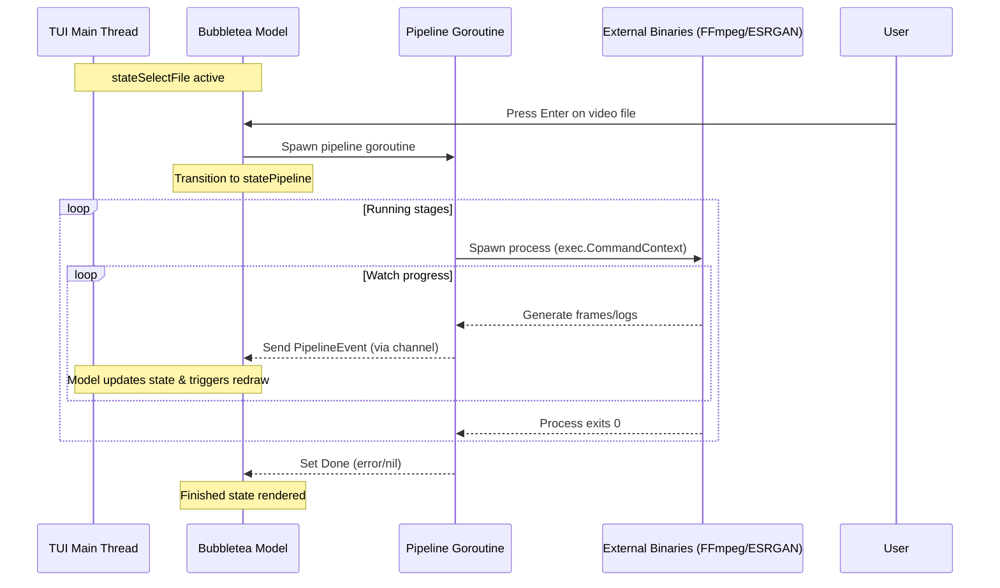
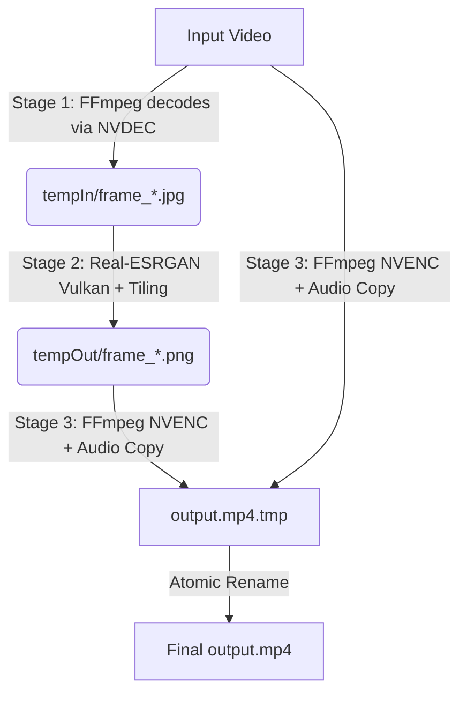

# Advanced Architecture and Engineering Design — bananascaler

This document details the internal design, concurrency patterns, and technical decisions behind **bananascaler**.

---

## 1. System Overview

**bananascaler** is built as a coordinator orchestrating high-performance media binaries. Instead of doing CPU-heavy frame operations in Go, the application delegates decoding, upscaling, and encoding to specialized C/C++ utilities (`ffmpeg` and `realesrgan-ncnn-vulkan`), while the Go runtime manages state, concurrency, safety guarantees, and the user interface.

```
                  +-----------------------------------+
                  |        bananascaler (Go)          |
                  |                                   |
                  |  +-------------+  +------------+  |
                  |  | Bubbletea   |  | Pipeline   |  |
                  |  | TUI Loop    |  | Goroutine  |  |
                  |  +------+------+  +-----+------+  |
                  +---------|---------------|---------+
                            |               |
             Render / Event |               | Spawn / Monitor
                            v               v
                     +------------+   +-----------+
                     |  Terminal  |   | FFmpeg /  |
                     |  Display   |   | Real-ESRG |
                     +------------+   +-----------+
```

---

## 2. Concurrency and Event Architecture

To keep the UI responsive during resource-intensive upscaling, **bananascaler** decouples TUI rendering from pipeline execution using Go's concurrency primitives.

### Concurrency Flow Diagram


### Event Dispatch Mechanism
- **Pipeline Goroutine**: Runs the 3-stage process. As it progresses, it sends `PipelineEvent` structs containing logs, active stages, and progress ratios through an unbuffered channel `events chan PipelineEvent`.
- **TUI Update Loop**: Bubletea's `Update` function listens to the channel using a recurring `tea.Cmd`. When an event arrives, it updates the progress bar ratios, appends logs, and issues a new `waitForEvent` command.

---

## 3. The 3-Stage Processing Pipeline



### Stage 1: Frame Extraction (GPU Decoded)
- **Tool**: `ffmpeg`
- **GPU Acceleration**: Utilizes `-hwaccel cuda` (NVDEC) to decode the input stream directly inside GPU VRAM, falling back to CPU decoding if unavailable.
- **Format**: Decodes frames and encodes them as MJPEG JPEGs (`-vcodec mjpeg -q:v 2`) into the input directory.
- **Optimizations**:
  - Near-lossless JPEG compression (`-q:v 2`) is chosen over PNG to reduce temp directory disk writes and lower I/O pressure by ~70% on NVMe SSDs.
  - VRAM-to-system memory copies are handled automatically by CUDA.

### Stage 2: Neural Upscaling (Vulkan Compute)
- **Tool**: `realesrgan-ncnn-vulkan`
- **GPU Acceleration**: Dispatched to GPU Vulkan compute kernels.
- **Tiling Safety**:
  - To prevent Vulkan driver memory allocation crashes (OOM/SEGV), the frames are subdivided into tiles (configured to a safe `-t 400` default or dynamically parsed from profiles).
  - Neural models (`realesr-animevideov3-x2`, `realesrgan-x4plus`) apply super-resolution on tiles and reconstruct them seamlessly.
  - Outputs lossless `.png` frames to the output directory.

### Stage 3: Re-encoding and Audio Muxing (GPU Encoded)
- **Tool**: `ffmpeg`
- **Format**: Reads PNG frames from the output directory using the `-framerate` detected during initialization.
- **Audio Copy**: Maps and remuxes the audio track from the original input file without re-encoding (`-c:a copy`) to preserve quality.
- **GPU Acceleration**: Encodes using H.265/HEVC hardware acceleration (`hevc_nvenc`), falling back to CPU (`libx265`) if unavailable.
- **Output**: Writes the stream into an atomic target file (`output.mp4.tmp`).

---

## 4. Reliability and Safety Guarantees

### Session Isolation
Parallel instances of **bananascaler** do not interfere with each other. Each run generates a unique session ID based on Unix timestamps and the host Process ID (PID):
```go
sessionID := fmt.Sprintf("bananascaler_%d_%d", time.Now().Unix(), os.Getpid())
tempIn := filepath.Join(os.TempDir(), sessionID+"_in")
tempOut := filepath.Join(os.TempDir(), sessionID+"_out")
```
This isolates frame directories completely.

### Atomic Write Pattern
To prevent leaving corrupt files if a run is interrupted:
1. All writing occurs in `output.mp4.tmp`.
2. Only when all stages return exit code `0` is the file atomically swapped to the target location:
   ```go
   os.Rename(tmpOutput, cfg.Output)
   ```
3. Temporary folders are immediately purged in a deferred cleanup hook.

### Graceful Cancellation (Signal Handling)
If a user presses `q` or issues a `SIGINT`/`SIGTERM` to the process:
- A `context.Context` cancellation is propagated.
- Underneath, `exec.CommandContext` automatically sends `SIGKILL` to the running children processes (`ffmpeg`/`realesrgan`).
- The deferred cleanup block purges `tempIn`, `tempOut`, and the partial `.tmp` output file, leaving the system clean.
